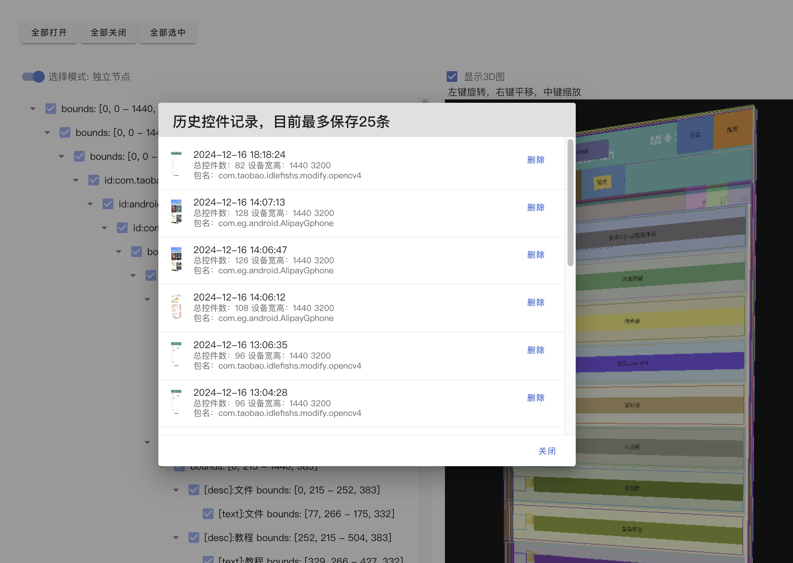

# 基于websocket插件的AutoJS控件辅助工具

- 无需额外提供服务器，只需要在手机端安装相应插件，并保持电脑和手机端在同一局域网内，即可提供一个可以实时获取控件信息，模拟点击或者执行自定义脚本的功能
- 操作演示：[https://www.bilibili.com/video/BV189qtYcECE](https://www.bilibili.com/video/BV189qtYcECE)

## 准备工作

- clone当前仓库到自己电脑上
- 设备和电脑需要在同一个局域网内,否则无法通过ip地址进行连接
- 先安装autojs插件, `./plugin/websocket-plugin.apk` ,源码地址:[https://github.com/TonyJiangWJ/websocketplugin](https://github.com/TonyJiangWJ/websocketplugin)
- 代码中用到的dex文件源代码见：[Auto.js/js-supports/autojs-tool-common](https://github.com/TonyJiangWJ/Auto.js/tree/main/js-supports/autojs-tool-common)
- 然后再将当前目录下的 `autojs-common.dex` , `WebSocket控件查看器.js` , `package.json` 复制到设备目录下,例如 `/sdcard/脚本/控件查看器/`
- 在浏览器中打开 `控件可视化/index.html`
- 在AutoJS中运行 `WebSocket控件查看器.js` ,根据提示授权截图权限和无障碍权限。查看记录日志中显示的当前ip地址. 将 `ws://ip:8212` 填写到浏览器表单的服务地址中,然后点击 `连接服务` 等待设备连接成功
- AutoJS Pro以及AutoX等可能修改了API导致无法正常使用，推荐使用困鱼或者修改版AutoJS，下载地址：`https://wwxs.lanzouq.com/b042le51i 密码:b034` 源代码地址：[https://github.com/TonyJiangWJ/Auto.js](https://github.com/TonyJiangWJ/Auto.js)

## 使用说明

- 当设备连接成功后，点击 `获取当前控件信息` 即可直接通过无障碍服务获取当前页面的控件信息，同时获取当前截图信息，展示在网页上
- 勾选 `高级功能` 后可以通过自定义函数过滤需要的节点，已经模拟包含AutoJS主要的UiSelector函数，例如： `textContains('xx') descMatches() clickable()` 等等，具体见AutoJS的文档。
  - `过滤函数` 是指，在节点树中只显示过滤函数所筛选后的节点，
  - `选择函数` 是指，根据提供的自定义函数，自动选中匹配的节点，用于验证自己的脚本是否满足自己所需要的效果。
- 勾选 `执行脚本` 后，再在执行脚本中填写需要发送并执行的脚本，点击 `发送执行` 即可发送到AutoJS上，让脚本自动执行，用于快速验证脚本的可行性。
  - `执行路径` 是指，当前发送的脚本所需要执行的工作路径，比如需要通过 `require('./lib/xxx.js')` 加载的脚本在 `/sdcard/脚本/MyScript/lib/xxx.js` 目录下。则可以填写 `/sdcard/脚本/MyScript/` 发送的脚本就可以正常加载 `xxx.js` 了，不需要多次传输多个文件。
- 鼠标在canvas中移动或者点击，可以调出快捷菜单，可以通过无障碍模拟点击控件中心点或者鼠标点击坐标。点击后将自动重新获取一遍控件信息，不过动画存在延迟，可以手动重新点击一遍 `获取当前控件信息` 获取加载后的界面。
  - 点击 `详情` 可以查看控件的详细信息
  - 点击 `排除` 可以让指定节点不在canvas中绘制
- 勾选 `显示3D图` 可以展示控件的立体效果，通过鼠标左中右键不同的方式进行交互，点击控件可以显示控件详情
- 界面参考：
  
  
  
  

## 待完成功能

- ~~当前websocket请求写的很烂，没有任何回调，后续优化~~ 已完成
- 适配实时传输画面的功能
- 节点树的操作可以优化一下
- `index.html` 中代码比较混乱需要重构一下，已完成部分代码重构
- 欢迎提交pr优化该功能
